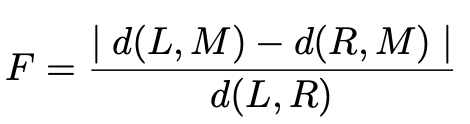
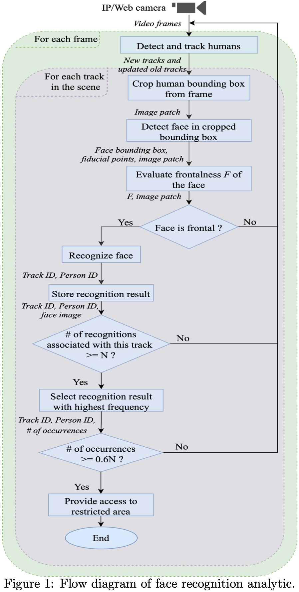
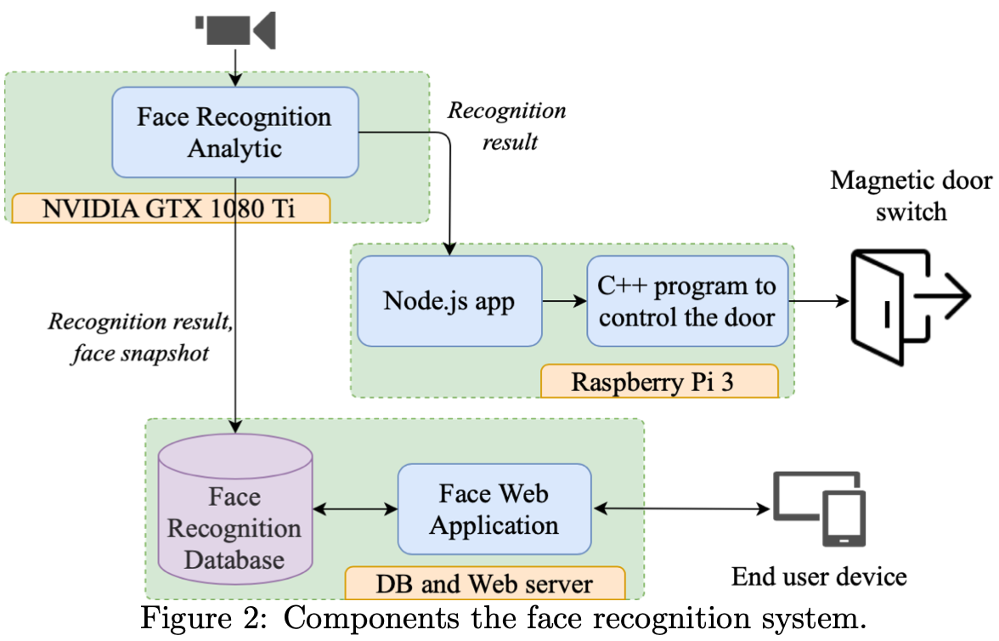

# Robust real-time video face recognition system for unconstrained environments

This repo contains the implementation of my paper entitled **Robust real-time video face recognition system for unconstrained environments**. This is an end to end robust face recognition system which can be used for real-time video face recognition. A novel frontal face detection measure is used which reduces the false positive recognitions by quite a margin.

We use a simple calculation based on the fiducial points of the two eyes and the nose to determine if a given face is frontal. The frontal face measure F is shown in the equation below. Consider the triangle LRN consisting of the left eye (L), right eye (R), and tip of the nose (N). MTCNN aligns the face so that R and L lie on the same row using a 2D affine transformation. We then calculate the point M on LR directly above N, then the frontalness of the face is the ratio



F = 0 means that the face is fully frontal, as in a mugshot, whereas F ≥ 1 means that the face is approximately in left or right profile. Given τ is a threshold value, any face with F < τ is considered a frontal face.


Figure 1 represents the overall flow of the system.



Figure 2 shows different components used in the system. This repo contains the code for the face recognition analytic component only.



Follow the [paper](https://spie.org/Publications/Proceedings/Paper/10.1117/12.2625989?SSO=1) for more details.


## Libraries used
- python3
- Tensorflow GPU 1.13.1
- OpenCV 3.4.2

## Other modules
- MTCNN for face detection
- FaceNet model for Face Recognition
- YoloV3 for human detection
- DeepSORT for human tracking

A SVM classifier for face recogntion needs to be trained on your dataset. Follow [this link](https://github.com/davidsandberg/facenet/wiki/Train-a-classifier-on-own-images) to train your classifier using FaceNet. Replace the **sFaceClassifierModel** key in the config file ```software/input/config/config.yaml```


*Note: This is quite an old implementation so the libraries used might be quite old.*

All the configurations are handled in ```software/input/config/config.yaml``` configuration file.

## Install dependencies
```
## To download required models
$ sh install/01-download-models.sh

$ cd software/apps/analytics

##Create your python virtual environment
$ python3 -m venv venv
$ source venv/bin/activate

##install requirements
$ pip3 install -r requirements.txt

##execute the program
$ python3 main.py
```

## Acknowledgements 🙏
Please cite the paper as mentioned below if you find this implementation helpful.

```
@inproceedings{rajak2022robust,
  title={Robust real-time video face recognition system for unconstrained environments},
  author={Rajak, Amir and Dailey, Matthew N and Ekpanyapong, Mongkol},
  booktitle={International Workshop on Advanced Imaging Technology (IWAIT) 2022},
  volume={12177},
  pages={545--550},
  year={2022},
  organization={SPIE}
}
```